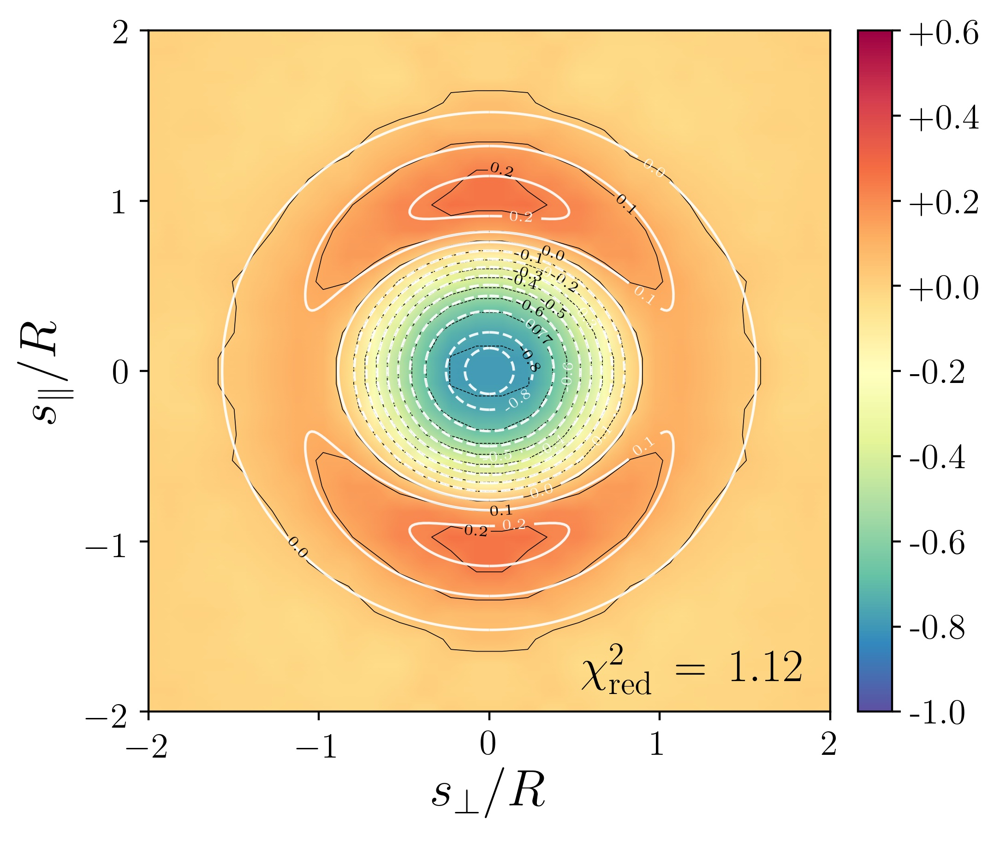

.. _plots:

Plots
======

*Voiager* produces several figures to visualize the input data and the inferred results, these are all stored in the `results/ <https://github.com/nhamaus/Voiager/tree/main/results/>`_ folder.

Catalog properties
------------------

   The file named ``void_sky`` contains a Mollweide projection of the angular distribution of void centers on the sky, color-coded by redshift

   In the file ``void_box`` the same void centers are shown in a Cartesian (comoving) coordinate system

   ``void_redshift`` is a scatter plot of the effective radius vs. the redshift of each void in the catalog

Void abundance
--------------

The most basic void features can be summarized via distributions. These are typically expressed as number densities per logarithmic interval of the void property. The file names start with ``n_``, followed by one of the following properties: ``compensation``, ``core-density``, ``density-contrast``, ``effective-radius``, ``ellipticity``, ``redshift``, ``richness``. Some examples are shown below:

   Distribution of void ``effective-radius`` (void size function) and corresponding randoms (dotted)

   Distribution of void ``ellipticity`` (void shape function)

   Distribution of void (and galaxy) ``redshift`` (selection function) and corresponding randoms (dotted)

Correlation functions
---------------------

Spatial correlations between void centers and tracers (galaxies) are provided in three variants: projected correlations on the sky named ``xi_p``, multipoles of the 3D correlation function named ``xi_ell``, and plane-of-sky vs. line-of-sight 2D correlation functions named ``xi_2d``. In addition, the file ``xi_ell=`` provides only one specified multipole order, appended as an integer in the name. Finally, the file ``xi_p_test`` features a test for the projected and deprojected correlation function from a best-fit HSW profile as a template for the real data. All of these file names are appended by an additional integer that specifies the particular bin of the data (e.g., redshift or effective radius).

   ``xi_p``: projected void-galaxy correlation function (downward triangles with model as dashed line), its deprojection (upward triangles with model as dotted line), and monopole in redshift space (circles with model as solid line)

   ``xi_ell``: monopole (circles with model as solid line), quadrupole (upward triangles with model as dashed line), and hexadecapole (downward triangles with model as dotted line) of void-galaxy correlation function

   ``xi_2d``: 2D void-galaxy cross-correlation function along and perpendicular to the line of sight (black contours with color scale) with best-fit model (white contour lines)

   ``xi_p_test``: best-fit HSW profile to deprojected void-galaxy correlation function (solid line), its projection on the sky (dashed line), and subsequent deprojection based on the inverse Abel transform (dotted line)

Covariance
----------

Covariance matrices for the void-galaxy correlation function are available, both for its multipoles, as well as for its 2D version with directions along and perpendicular to the line of sight.

   ``cov_ell``: covariance matrix for multipoles of the void-galaxy correlation function, normalized by its diagonal

   ``cov_2d``: covariance matrix for the 2D void-galaxy correlation function, normalized by its diagonal

Parameter inference
-------------------

The likelihood analysis of the void-galaxy correlation function provides constraints on dynamic and geometric distortions, which can be paramerized via the ratio of growth rate and bias :math:`f/b`, and the *Alcock-Paczynski* parameter ratio :math:`q_\perp/q_\parallel`, respectively. The files named ``triangle`` contain a corner plot of the posterior probability distribution (including nuisance parameters :math:`\mathcal{M}` and :math:`\mathcal{Q}`) for each bin of the data vector. These parameters are proportional to the product of growth rate and rms fluctuation amplitude :math:`f\sigma_8`, as well as the product of comoving angular diameter distance and Hubble rate :math:`D_\mathrm{A}H`, which are shown in the file ``fs8_DAH``. In turn, measurements of :math:`D_\mathrm{A}H` probe the expansion history of the Universe and can be used to infer some fundamental cosmological parameters. The files named ``triangle``, appended by the particular assumed model (e.g., ``LCDM``, ``wCDM``, or ``w0waCDM``) contain the posterior distribution of the constrained cosmological parameters of the specified model.

.. figure:: ../results/Beyond2pt/C_mock_lightcone_0240/triangle_2.jpg
   :scale: 20 %
   :align: center

   ``triangle``: corner plot of posterior distribution for model and nuisance parameters with its maximum (white cross). Shown are 68% and 95% confidence regions and the fiducial model as dashed lines.

   ``fs8_DAH``: measurements of :math:`f\sigma_8` and :math:`D_\mathrm{A}H` as a function of redshift (fiducial model as dotted line)

.. figure:: ../results/Beyond2pt/C_mock_lightcone_0240/triangle_wCDM.jpg
   :scale: 30 %
   :align: center

   ``triangle_wCDM``: posterior of model parameters in a \ *w*\ CDM cosmology (blinded by mean) with its maximum (white cross)

